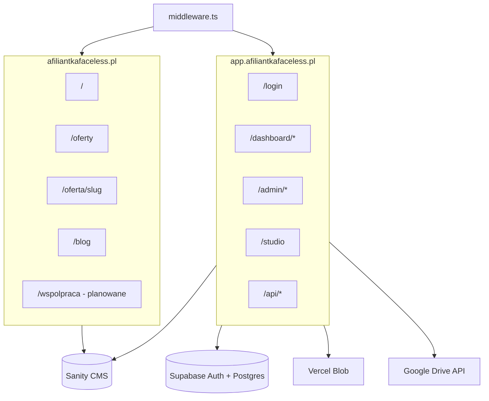
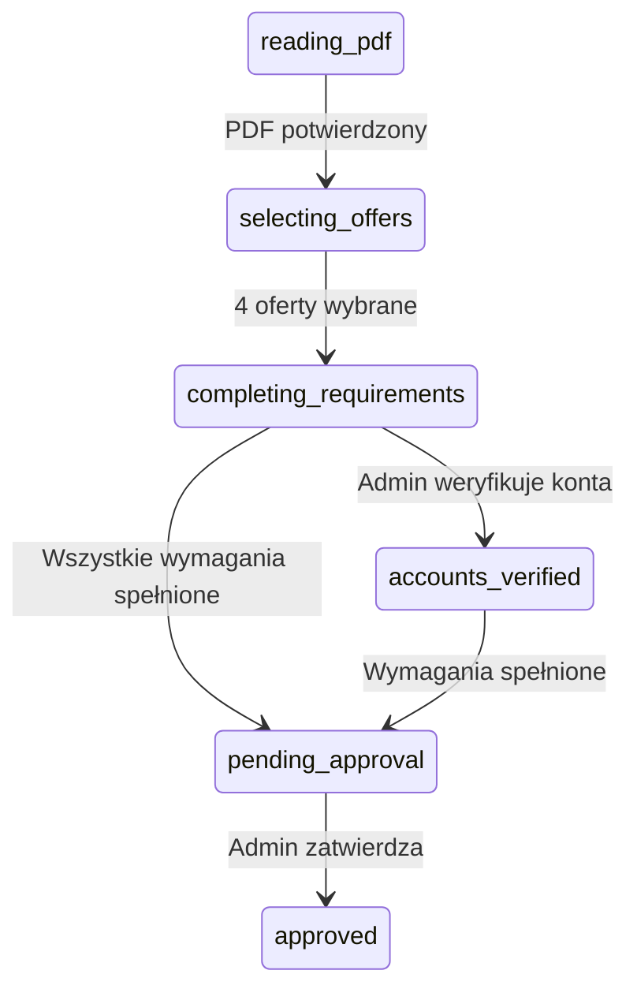
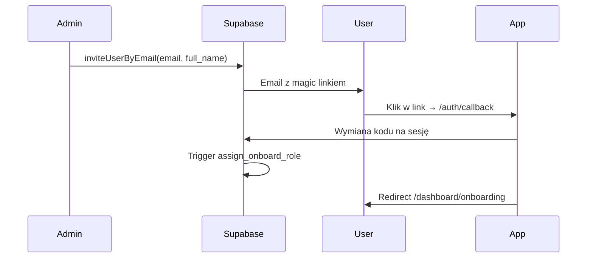
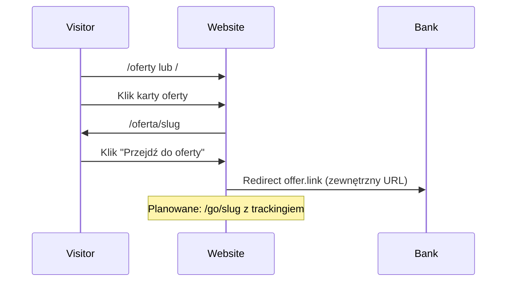
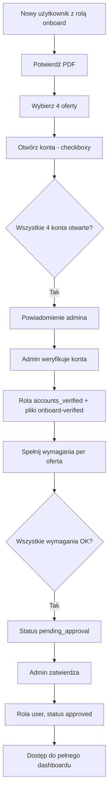

# Specyfikacja projektu — Afiliantka Faceless

> Dokument referencyjny dla deweloperów i agentów kodujących. Opisuje wizję produktu, aktualny stan implementacji, planowane funkcje oraz kluczowe przepływy biznesowe.
>
> **Powiązane dokumenty:** [`.cursor/rules/guidelines.mdc`](../.cursor/rules/guidelines.mdc) (konwencje kodu), [`ROADMAP.md`](../ROADMAP.md) (lista zadań technicznych).

---

## 1. Streszczenie wykonawcze

**Afiliantka Faceless** to platforma afiliacyjna w modelu „faceless” — współpracownicy promują oferty bankowe (konta osobiste, konta firmowe, karty kredytowe) bez budowania własnej publicznej marki. Produkt składa się z dwóch powierzchni hostowanych na osobnych domenach:

| Powierzchnia | Domena produkcyjna | Cel |
|---|---|---|
| **Strona publiczna** | `afiliantkafaceless.pl` | Landing z aktualnymi promocjami bankowymi, linkami afiliacyjnymi, treścią edukacyjną i stroną współpracy afiliacyjnej |
| **Panel SaaS** | `app.afiliantkafaceless.pl` | Portal dla współpracowników i administratorów: onboarding, zarządzanie użytkownikami, dostęp do materiałów; docelowo czat społecznościowy i narzędzia AI |

**Model dostępu:** invite-only — nowi współpracownicy dołączają wyłącznie na zaproszenie administratora (magic link OTP przez Supabase). Strona `/wspolpraca` informuje o procesie współpracy i kieruje do logowania lub prośby o zaproszenie — bez samodzielnej rejestracji.

**Język UI:** polski (wyjątek: strona logowania jest częściowo po angielsku — do ujednolicenia).

**Stan projektu:** rdzeń platformy (onboarding, role, pliki, panel admina, strona publiczna z ofertami i blogiem) jest zaimplementowany. Priorytetowe braki biznesowe: strona współpracy, strony prawne, affiliate disclosure, przebudowa UI publicznej. Docelowo: czat między użytkownikami, potem narzędzia AI do tworzenia treści.

---

## 2. Domeny i architektura

### 2.1 Routing hostów

Aplikacja Next.js obsługuje dwa hosty przez [`middleware.ts`](../middleware.ts):

- **`WEB_HOST`** (domyślnie `localhost`, produkcja: `afiliantkafaceless.pl`) — strona publiczna
- **`APP_HOST`** (domyślnie `app.localhost`, produkcja: `app.afiliantkafaceless.pl`) — panel aplikacji

Trasy app (`/login`, `/dashboard`, `/admin`, `/studio`, `/api`, `/auth`) wywołane na domenie publicznej są przekierowywane na subdomenę app (`APP_ORIGIN`).



### 2.2 Grupy tras

| Grupa | Ścieżka | Opis |
|---|---|---|
| Strona publiczna | `app/(website)/` | Bez auth, ISR, SEO |
| Panel aplikacji | `app/(app)/` | Auth wymagany (middleware), dashboard, admin, API, studio |

### 2.3 Stack technologiczny

| Warstwa | Technologia |
|---|---|
| Framework | Next.js 16 (App Router, Turbopack) |
| Język | TypeScript strict |
| UI | Tailwind CSS 4, shadcn/ui, Lucide icons |
| CMS | Sanity (schematy inline w `sanity.config.ts`) |
| Auth + DB | Supabase (magic link OTP, Postgres, RLS) |
| Pliki (małe) | Vercel Blob |
| Pliki (duże) | Google Drive API (service account) |
| Analityka | Vercel Analytics + Speed Insights |

### 2.4 Zmienne środowiskowe (kluczowe)

| Zmienna | Opis |
|---|---|
| `WEB_HOST` / `APP_HOST` | Hosty routingu |
| `APP_ORIGIN` / `NEXT_PUBLIC_APP_ORIGIN` | URL subdomeny app |
| `NEXT_PUBLIC_SITE_URL` | Kanoniczny URL strony publicznej (produkcja: `https://afiliantkafaceless.pl`) |
| `NEXT_PUBLIC_SUPABASE_URL` / `NEXT_PUBLIC_SUPABASE_ANON_KEY` | Supabase (wymagane) |
| `SUPABASE_SERVICE_ROLE_KEY` | Operacje serwerowe (admin client) |
| `BLOB_READ_WRITE_TOKEN` | Vercel Blob |
| `GOOGLE_SERVICE_ACCOUNT_EMAIL` / `GOOGLE_SERVICE_ACCOUNT_PRIVATE_KEY` | Google Drive |
| `NEXT_PUBLIC_SANITY_*` | Sanity CMS |

---

## 3. Persony użytkowników

| Persona | Dostęp | Potrzeby |
|---|---|---|
| **Odwiedzający publiczny** | Strona www | Przeglądanie promocji bankowych, czytanie bloga, dowiedzenie się o współpracy afiliacyjnej |
| **Współpracownik (onboard)** | App — rola `onboard` | Przejście onboardingu: PDF → wybór 4 ofert → otwarcie kont → spełnienie wymagań → akceptacja admina |
| **Współpracownik (aktywny)** | App — rola `user` | Dostęp do materiałów, zasobów, plików; docelowo czat z innymi użytkownikami |
| **Moderator** | App — rola `moderator` | Zarządzanie plikami (Blob + Drive), bez dostępu do użytkowników i logów aktywności |
| **Administrator** | App — rola `admin` | Pełne zarządzanie: użytkownicy, zaproszenia, onboarding, powiadomienia, aktywność, Drive, Sanity Studio |

---

## 4. Strona publiczna (`afiliantkafaceless.pl`)

### 4.1 Zaimplementowane — trasy i funkcje

| Trasa | Plik | Opis |
|---|---|---|
| `/` | `app/(website)/page.tsx` | Strona główna: logo (`AppLogo`), sekcja „Jak to działa”, filtr ofert z karuzelą wyróżnionych i listą, FAQ |
| `/oferty` | `app/(website)/oferty/page.tsx` | Pełna lista ofert z filtrem kategorii i wyszukiwarką tekstową |
| `/oferta/[slug]` | `app/(website)/oferta/[slug]/page.tsx` | Szczegóły oferty: opis (Portable Text), obraz, PDF-y, CTA „Przejdź do oferty” |
| `/blog` | `app/(website)/blog/page.tsx` | Lista wpisów (wyróżniony + siatka) |
| `/blog/[slug]` | `app/(website)/blog/[slug]/page.tsx` | Szczegóły wpisu, czas czytania, JSON-LD `BlogPosting` |

**Layout:** `app/(website)/layout.tsx` — `Header` + `Footer`.

**Kategorie ofert (Sanity `offer.category`):**

| Wartość | Etykieta PL |
|---|---|
| `personal` | Osobiste |
| `business` | Biznesowe |
| `credit-cards` | Karty kredytowe |

**CMS (Sanity)** — typy zdefiniowane w `sanity.config.ts`:

| Typ | Pola kluczowe | Użycie |
|---|---|---|
| `offer` | title, description, image, link, featured, category, files (PDF), requirement, slug | Oferty publiczne + onboarding |
| `heroSection` | title, description, image | Hero (częściowo — tylko `image` przez `AppLogo`) |
| `blog` | title, slug, content (plain text), image, date, author | Blog |
| `faq` | question, answer, order | FAQ na stronie głównej |
| `howItWorks` | title, description, icon, order | Sekcja „Jak to działa” |

**SEO i wydajność:**
- Metadata + OG na layout i stronach
- `app/sitemap.ts` — home, `/oferty`, `/blog`, wszystkie slugi ofert i bloga
- `app/robots.ts` — publiczne dozwolone, app/admin/studio/api zablokowane
- JSON-LD: `Organization` (root), `Product` (oferty), `BlogPosting` (blog)
- ISR (`revalidate: 300`), `generateStaticParams` na slugach

**Nawigacja:**
- Header: Oferty, Blog, Login/Dashboard (link do subdomeny app)
- Footer: linki nawigacyjne; polityka prywatności i regulamin to placeholdery (`href="#"`)

**Przepływ afiliacyjny (publiczny):**
1. Karta oferty → link wewnętrzny `/oferta/[slug]`
2. Strona szczegółów → przycisk „Przejdź do oferty” → zewnętrzny URL (`offer.link`, `target="_blank"`)
3. Brak proxy `/go/[slug]` i trackingu kliknięć
4. Brak affiliate disclosure na stronach ofert

**Uwaga:** komponent `components/sections/hero-section.tsx` (pełny hero z tytułem, opisem, CTA) istnieje, ale **nie jest używany** na stronie głównej — zamiast niego renderowany jest `AppLogo`.

### 4.2 Planowane — strona publiczna

#### Faza A — Strona współpracy afiliacyjnej (priorytet biznesowy)

| Element | Opis |
|---|---|
| Trasa `/wspolpraca` | Nowa strona w `app/(website)/wspolpraca/` |
| CMS | Nowy typ Sanity `cooperationPage`: korzyści współpracy, opis procesu dołączenia, FAQ współpracy |
| CTA „Zaloguj się” | Link do `app.afiliantkafaceless.pl/login` |
| CTA „Poproś o zaproszenie” | Początkowo mailto lub kontakt z adminem (bez samodzielnej rejestracji) |
| Nawigacja | Link w headerze i footerze |
| Affiliate disclosure | Informacja o linkach partnerskich na stronach ofert |

#### Faza B — Przebudowa UI (ROADMAP Phase 4.5)

- Pełny hero z nagłówkiem i CTA „Zobacz oferty”
- Redesign kart ofert, grida, filtra, footera (kolumny, social, legal)
- Strony prawne: Polityka prywatności, Regulamin
- Ujednolicony layout — integracja logo z hero/headerem

#### Faza C — Content & engagement (ROADMAP Phase 4.7)

- Newsletter (zapis email → Supabase, eksport admin)
- Testimonials (nowy typ Sanity)
- Porównywarka 2–3 ofert
- Blog: Portable Text zamiast plain text; powiązane oferty
- Rozszerzenie schematu `offer`: kwota bonusu, warunki, data ważności, nazwa banku

#### Faza D — Analityka publiczna (ROADMAP Phase 4.8)

- Tracking wyświetleń stron i kliknięć w linki afiliacyjne
- Proxy redirect `/go/[slug]` z logowaniem kliknięć
- Dashboard analityczny w panelu admina

---

## 5. Panel SaaS (`app.afiliantkafaceless.pl`)

### 5.1 Zaimplementowane — autentykacja

| Element | Opis |
|---|---|
| `/login` | Magic link OTP (Supabase), formularz email |
| `/auth/callback` | Wymiana kodu OAuth na sesję; opcjonalna walidacja `invitation_token` |
| `/auth/auth-code-error` | Strona błędu auth |
| Middleware | Wymusza sesję na `APP_HOST` (wyjątki: login, auth callback, auth error) |
| `/` na app host | Redirect do `/dashboard` (sesja) lub `/login` |

### 5.2 Zaimplementowane — dashboard współpracownika

| Trasa | Opis |
|---|---|
| `/dashboard` | Panel powitalny z linkami do sekcji |
| `/dashboard/onboarding` | Kreator wieloetapowy (PDF → wybór 4 ofert → checkboxy kont/wymagań → oczekiwanie na admina) |
| `/dashboard/offers` | Katalog ofert Sanity (widoczny dla roli `onboard` w sidebarze) |
| `/dashboard/onboard` | Przeglądarka plików sekcji onboardingu |
| `/dashboard/resources` | Materiały zasobów |
| `/dashboard/files` | Zunifikowana przeglądarka Blob + Drive z zakładkami sekcji |
| `/dashboard/profile` | Profil: dane, role, status onboardingu, liczba aktywności |

**Routing roli `onboard`:** użytkownicy z samą rolą `onboard` (bez `user`/`admin`/`moderator`) są przekierowywani do `/dashboard/onboarding` — wyjątki: `/dashboard/onboarding` i `/dashboard/offers` (`dashboard/layout.tsx`).

**UI:** `AppShell` — sidebar slide-over na mobile, stały na `md+`; mobile-first.

### 5.3 Zaimplementowane — onboarding

#### Maszyna stanów

Statusy (`types/onboarding.ts`):

```
reading_pdf → selecting_offers → completing_requirements → accounts_verified → pending_approval → approved
```



#### Kroki szczegółowe

1. **PDF** — użytkownik potwierdza przeczytanie materiału z Google Drive (sekcja `onboard`)
2. **Wybór ofert** — dokładnie 4 oferty z Sanity; każda ma pole `requirement` (tekst wymagania)
3. **Konta i wymagania** — per oferta: checkbox „konto otwarte” + „wymaganie spełnione”
4. **Powiadomienie admina** — po otwarciu wszystkich 4 kont (`accounts_opened`)
5. **Weryfikacja kont** — admin klika „Zweryfikuj konta” → rola `accounts_verified`, odblokowanie plików sekcji `onboard-verified`
6. **Oczekiwanie na akceptację** — status `pending_approval` po spełnieniu wymagań
7. **Zatwierdzenie** — admin zatwierdza → rola `onboard` usuwana, dodawana `user`, status `approved`

**API onboarding:** `/api/onboarding/status`, `/offers`, `/select-offers`, `/open-account`, `/complete-requirement`

**API admin:** `/api/admin/approve-onboarding`, `/api/admin/reject-offer`

**Odrzucenie oferty:** admin może odrzucić per oferta z powodem (`rejection_reason`); użytkownik widzi status odrzucenia.

### 5.4 Zaimplementowane — panel administracyjny

| Trasa | Dostęp | Opis |
|---|---|---|
| `/admin` | admin / moderator | Karty nawigacyjne; „System Overview” = stub „Coming soon” |
| `/admin/users` | admin | Zaproszenia (email + imię), przypisywanie ról, status onboardingu, weryfikacja kont, approve/reject |
| `/admin/files` | admin / moderator | Upload do Vercel Blob |
| `/admin/drive` | admin / moderator | Konfiguracja źródeł Google Drive (picker, sekcja, `role_required`) |
| `/admin/activity` | admin | Log aktywności użytkowników (paginacja) |

**Zaproszenia:** admin wysyła invite przez `inviteUserByEmail` z opcjonalnym imieniem (`user_metadata.full_name`). Nowy użytkownik dostaje automatycznie rolę `onboard` (trigger na `auth.users` INSERT).

**Powiadomienia:** dzwonek w layoucie admina (`admin_notifications`), polling, oznaczanie jako przeczytane.

### 5.5 Zaimplementowane — pliki i treści

| Źródło | Opis |
|---|---|
| **Sanity Studio** (`/studio`) | Edycja ofert, bloga, FAQ, hero — **brak guarda roli admin** (każdy zalogowany) |
| **Vercel Blob** | Upload przez admin (`/api/blobs`); lista dla zalogowanych (`/api/blobs/list`) |
| **Google Drive** | Źródła w tabeli `drive_sources`; list/download z kontrolą dostępu i `role_required` |

**Sekcje Drive (przykłady):** `onboard`, `onboard-verified`, `resources` — konfigurowane przez admina z opcjonalnym `role_required`.

**Komponent `FileBrowser`:** wspólna przeglądarka z zakładkami sekcji, wyszukiwaniem, grupowaniem folderów, `sendBeacon` do trackingu pobrań.

### 5.6 Zaimplementowane — role i aktywność

#### Role

| Rola | Opis |
|---|---|
| `admin` | Pełny dostęp do panelu i użytkowników |
| `moderator` | Pliki, Drive — bez users/activity |
| `user` | Aktywny współpracownik po onboardingu |
| `onboard` | Nowy użytkownik w procesie onboardingu |
| `accounts_verified` | Po weryfikacji kont przez admina (odblokowuje `onboard-verified`) |

**RPC:** `get_user_roles`, `user_has_permission`, `is_user_admin` — `lib/roles.ts`.

#### Śledzenie aktywności

Tabela `user_activity` — logowane akcje: pobrania/wyświetlenia plików, wybór/usunięcie ofert, otwarcie kont, spełnienie wymagań.

API: `POST /api/activity/track`, `GET /api/admin/activity`.

### 5.7 Planowane — panel SaaS

#### Faza E — Dojrzałość platformy (ROADMAP Phase 4.9 + 5)

- Powiadomienia email (nowe treści, zmiana statusu onboardingu)
- Wersjonowanie treści („co nowego” per użytkownik)
- Brandowane szablony email (magic link, zaproszenie)
- Rate limiting na auth i API
- Globalne error boundaries, strony 404/500
- Testy jednostkowe (logika ról) i integracyjne (auth flow)
- CI/CD (lint, typecheck, preview deployments)
- Monitoring błędów (Sentry lub podobne)
- Zaostrzenie RLS na `user_roles`
- Guard roli admin na `/studio`
- Server-side filtrowanie Blob (obecnie client-side)
- Migracja seed roli `onboard`
- Pełne wykorzystanie tabeli `invitations` (token-based invites)
- Dezaktywacja/usuwanie użytkowników w UI admina
- Dashboard analityczny (rejestracje, completion rate onboardingu, popularne oferty/pliki)
- Ujednolicenie języka UI (login po polsku)

#### Faza F — Czat społecznościowy (priorytet docelowy)

Klasyczny czat między użytkownikami współpracującymi — **nie** chatbot wsparcia.

| Funkcja | Opis |
|---|---|
| Dostęp | Role `user` i wyżej (po zakończonym onboardingu) |
| Wiadomości 1:1 | Prywatne konwersacje między współpracownikami |
| Kanał ogólny | Opcjonalny kanał grupowy dla całej społeczności (start: 1:1 + kanał ogólny) |
| Real-time | Supabase Realtime lub tabela `messages` + subscriptions |
| Moderacja | Admin/moderator: przegląd zgłoszeń, blokowanie użytkowników |
| UI | Nowa sekcja w dashboardzie (np. `/dashboard/czat`) |
| AI | **Brak** w tej fazie |

**Planowane tabele Supabase:** `conversations`, `messages`, ewentualnie `chat_reports`.

#### Faza G — Narzędzia AI (późniejszy etap)

Asystent AI w panelu — narzędzie rozwoju, **nie** pierwsza linia wsparcia.

| Funkcja | Opis |
|---|---|
| Tworzenie treści | Pomoc w pisaniu postów, opisów ofert, materiałów promocyjnych |
| Profile społecznościowe | Pomoc w budowaniu i optymalizacji profili social media |
| Integracja | Zewnętrzne LLM API (OpenAI / Anthropic — do wyboru przy implementacji) |
| Limity | Logowanie użycia, limity per użytkownik |
| UI | Osobna sekcja (np. `/dashboard/narzedzia` lub `/dashboard/ai`) |
| Czat użytkowników | Niezależny moduł — AI nie zastępuje czatu społecznościowego |

---

## 6. Przepływy biznesowe

### 6.1 Zaproszenie nowego współpracownika



### 6.2 Kliknięcie linku afiliacyjnego (publiczny)



### 6.3 Onboarding — pełny cykl



---

## 7. Model danych

### 7.1 Sanity CMS

| Typ | Status | Pola kluczowe |
|---|---|---|
| `offer` | Zaimplementowany | title, description (Portable Text), image, link, featured, category, files (PDF), requirement, slug |
| `heroSection` | Zaimplementowany | title, description, image |
| `blog` | Zaimplementowany | title, slug, content (plain text), image, date, author |
| `faq` | Zaimplementowany | question, answer, order |
| `howItWorks` | Zaimplementowany | title, description, icon, order |
| `cooperationPage` | Planowany | sekcje treści, CTA, FAQ współpracy |
| `testimonial` | Planowany | cytat, autor, zdjęcie, order |

### 7.2 Supabase

| Tabela | Status | Cel |
|---|---|---|
| `roles` | Zaimplementowany | Definicje ról + JSONB permissions |
| `user_roles` | Zaimplementowany | Przypisania użytkownik ↔ rola |
| `invitations` | Zaimplementowany (niedowykorzystany) | Tokeny zaproszeń |
| `user_onboarding` | Zaimplementowany | Postęp onboardingu per użytkownik |
| `user_offer_selections` | Zaimplementowany | Wybrane oferty + flagi kont/wymagań + odrzucenia |
| `admin_notifications` | Zaimplementowany | Powiadomienia dla admina |
| `drive_sources` | Zaimplementowany | Mapowanie plików/folderów Google Drive |
| `user_activity` | Zaimplementowany | Audit log aktywności |
| `newsletter_subscribers` | Planowany | Zapis newslettera |
| `conversations` | Planowany | Czat — konwersacje |
| `messages` | Planowany | Czat — wiadomości |

**Migracje:** `supabase/migrations/`

### 7.3 Typy TypeScript

| Plik | Zawartość |
|---|---|
| `types/offer.ts` | `Offer`, `HeroContent`, `PortableTextBlock` |
| `types/role.ts` | `Role`, `UserRole`, `Permission`, `DEFAULT_ROLES` |
| `types/onboarding.ts` | `OnboardingStatus`, `UserOnboarding`, `UserOfferSelection`, `AdminNotification` |
| `types/file.ts` | `FileItem`, `DriveSource` |

---

## 8. Role i uprawnienia — macierz dostępu

| Funkcja | onboard | user | moderator | admin |
|---|---|---|---|---|
| Dashboard onboarding | ✓ (wymuszony) | — | — | — |
| Dashboard oferty (onboard) | ✓ | — | — | — |
| Dashboard pliki/zasoby | — | ✓ | ✓ | ✓ |
| Dashboard profil | ✓ | ✓ | ✓ | ✓ |
| Dashboard czat (planowany) | — | ✓ | ✓ | ✓ |
| Admin pliki/drive | — | — | ✓ | ✓ |
| Admin użytkownicy | — | — | — | ✓ |
| Admin aktywność | — | — | — | ✓ |
| Sanity Studio | ✓* | ✓* | ✓* | ✓ |

\* Obecnie każdy zalogowany użytkownik — do zaostrzenia (guard admin).

**Uprawnienia JSONB** (`roles.permissions`): `manage_users`, `manage_files`, `manage_offers`, `view_analytics`, `view_offers`, `view_files` — zdefiniowane, ale `checkPermission()` nie jest używane w trasach API (sprawdzane są role bezpośrednio).

---

## 9. Integracje zewnętrzne

| Usługa | Rola w produkcie | Pliki kluczowe |
|---|---|---|
| **Supabase** | Auth OTP, Postgres, RLS; docelowo Realtime (czat) | `lib/supabase/server.ts`, `lib/supabase/client.ts` |
| **Sanity** | CMS treści publicznych i ofert | `sanity.config.ts`, `sanity/lib/client.ts` |
| **Vercel Blob** | Małe pliki, uploady admin | `app/(app)/api/blobs/` |
| **Google Drive** | Duże materiały (PDF onboardingu, zasoby) | `lib/google-drive.ts` |
| **Vercel Analytics** | Analityka ruchu | `app/layout.tsx` |
| **LLM API** *(planowany)* | Narzędzia AI do tworzenia treści | TBD |

---

## 10. Wymagania niefunkcjonalne

| Obszar | Wymaganie |
|---|---|
| **Responsywność** | Mobile-first obowiązkowe; start od 320px; touch targets min. 44×44px |
| **Język** | Polski dla całego UI użytkownika |
| **Bezpieczeństwo** | Każda trasa API: `getSession()`; admin: `isCurrentUserAdmin()`; Drive download walidowany względem `drive_sources` |
| **SEO** | Strona publiczna indeksowalna; panel/admin/studio/api — `noindex` |
| **Wydajność** | ISR na stronach publicznych; `generateStaticParams` na slugach |
| **Dostępność** | Planowane: focus states, ARIA, keyboard nav (ROADMAP Phase 4.9) |
| **Kod** | TypeScript strict, brak `any`, brak `console.log`, polski tekst UI |

Szczegóły implementacji UI: [`.cursor/skills/frontend-ui/SKILL.md`](../.cursor/skills/frontend-ui/SKILL.md).

---

## 11. Znane luki i dług techniczny

Agent kodujący powinien uwzględniać te punkty przy każdej pracy:

| # | Problem | Wpływ | Rekomendacja |
|---|---|---|---|
| 1 | Rola `onboard` nie seedowana w migracjach | Trigger auto-assign nie działa na czystej bazie | Dodać migrację INSERT roli `onboard` |
| 2 | `/studio` bez guarda admin | Każdy zalogowany może edytować CMS | Dodać sprawdzenie roli admin w layoucie studio |
| 3 | RLS `user_roles` zbyt permissive | Każdy auth user może zarządzać rolami na poziomie DB | Zaostrzyć polityki RLS |
| 4 | `/api/blobs/list` bez filtrowania serwerowego | Wszystkie bloby widoczne dla zalogowanych | Filtrować po roli/sekcji server-side |
| 5 | Tabela `invitations` nieużywana | Token-based invite flow nieaktywny | Zintegrować z flow zaproszeń lub usunąć |
| 6 | `NEXT_PUBLIC_SITE_URL` fallback `afiliantka.pl` | Niezgodność z produkcyjną domeną | Zmienić na `afiliantkafaceless.pl` |
| 7 | `HeroSection` nieużywany na home | CMS hero niewykorzystany | Użyć w Phase 4.5 lub usunąć `AppLogo` |
| 8 | Footer: linki prawne `#` | Brak compliance | Dodać strony polityki i regulaminu |
| 9 | Brak `/wspolpraca` | Brak strony o współpracy afiliacyjnej | Phase 4.6 |
| 10 | README nieaktualny | Mylące dla nowych deweloperów | Zaktualizować przy okazji |
| 11 | Login częściowo po angielsku | Niespójność językowa | Przetłumaczyć na PL |
| 12 | Guidelines mówią o schemacie `news` | Nieaktualna dokumentacja | Już poprawione na `blog` w kodzie |

---

## 12. Roadmapa produktowa (skrót)

Pełna lista zadań technicznych: [`ROADMAP.md`](../ROADMAP.md).

| Faza | Nazwa | Status |
|---|---|---|
| 1–3.5 | Fundament, Drive, onboarding, UX | ✅ Ukończone |
| 4 | SEO, filtry, blog, CMS home | ✅ Ukończone |
| 4.5 | Przebudowa UI strony publicznej | 🔲 Planowane |
| 4.6 | Strona współpracy afiliacyjnej (`/wspolpraca`) | 🔲 Planowane — priorytet |
| 4.7 | Newsletter, testimonials, porównywarka, blog rich | 🔲 Planowane |
| 4.8 | Analityka publiczna, tracking kliknięć | 🔲 Planowane |
| 4.9 | Powiadomienia email, wersjonowanie treści, a11y | 🔲 Planowane |
| 5 | Email templates, rate limiting, testy, CI/CD, monitoring | 🔲 Planowane |
| 6 | Czat społecznościowy między użytkownikami | 🔲 Planowane |
| 7 | Narzędzia AI (treści, profile social media) | 🔲 Planowane (późniejszy etap) |

---

## 13. Konwencje dla agentów kodujących

Przy implementacji nowych funkcji:

1. **Przeczytaj tę specyfikację** — zrozum kontekst biznesowy przed kodowaniem
2. **Stosuj konwencje z** [`.cursor/rules/guidelines.mdc`](../.cursor/rules/guidelines.mdc) — route groups, API auth, mobile-first, polski UI
3. **UI:** użyj skill [frontend-ui](../.cursor/skills/frontend-ui/SKILL.md) przy każdej zmianie TSX
4. **Nie twórz tras poza** `app/(website)/` i `app/(app)/`
5. **API routes** — zawsze pod `app/(app)/api/`, zawsze sprawdź sesję Supabase
6. **Sanity** — jeden klient (`sanity/lib/client.ts`), schematy w `sanity.config.ts`
7. **Nowe funkcje planowane** — sprawdź odpowiednią fazę w ROADMAP i zaktualizuj ją po implementacji
8. **Dług techniczny** — nie pogarszaj znanych luk; naprawiaj je, gdy dotykasz powiązanego kodu

---

*Ostatnia aktualizacja specyfikacji: lipiec 2026*
