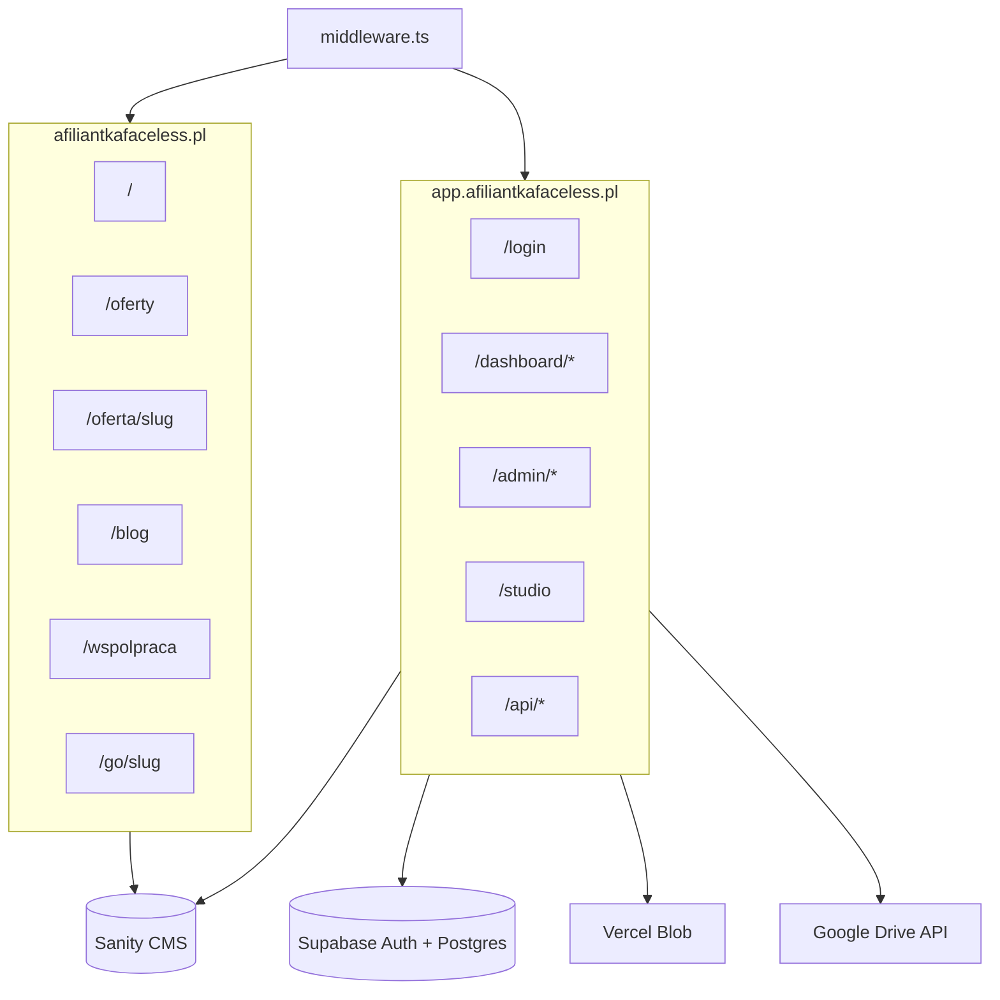
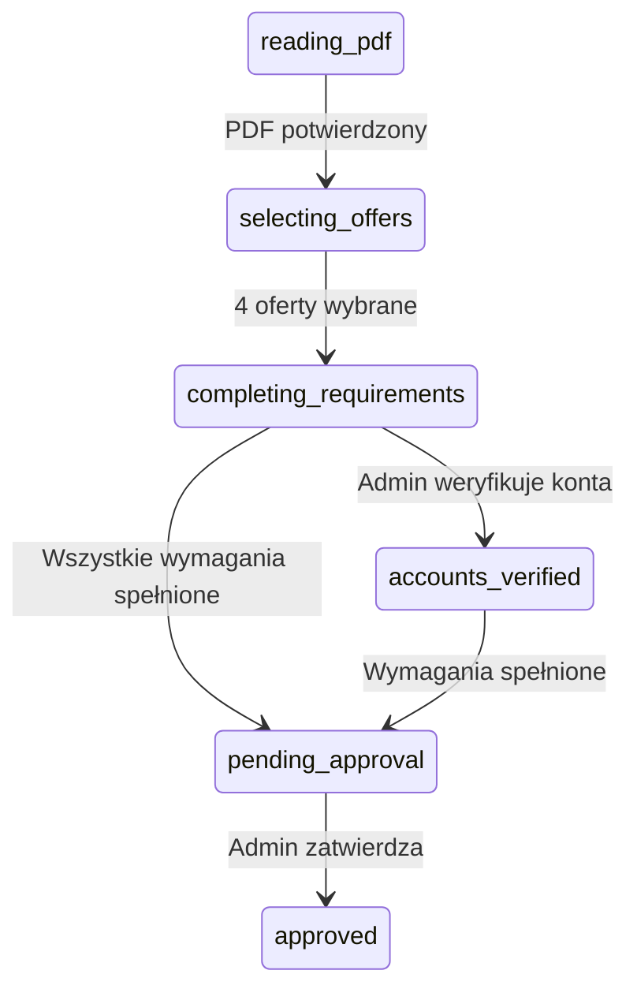
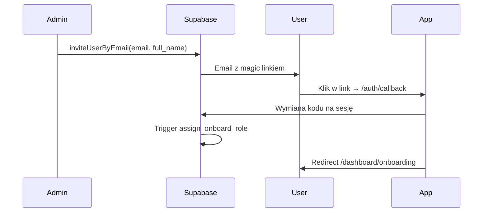
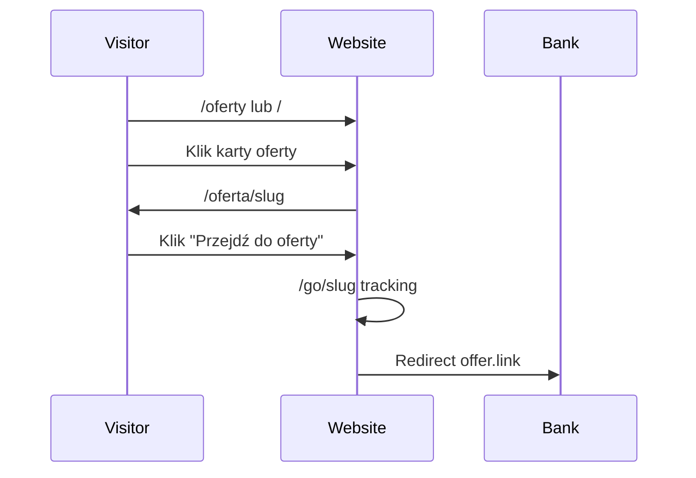
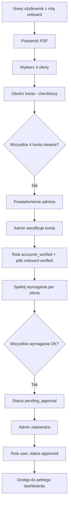

# Specyfikacja projektu — Afiliantka Faceless

> Dokument referencyjny dla deweloperów i agentów kodujących. Opisuje wizję produktu, aktualny stan implementacji, planowane funkcje oraz kluczowe przepływy biznesowe.
>
> **Powiązane dokumenty:** [`AGENTS.md`](../AGENTS.md) (workflow agentów + Linear), [`.cursor/rules/guidelines.mdc`](../.cursor/rules/guidelines.mdc) (konwencje kodu), [`ROADMAP.md`](../ROADMAP.md) (lista zadań technicznych).

---

## 1. Streszczenie wykonawcze

**Afiliantka Faceless** to platforma afiliacyjna w modelu „faceless” — współpracownicy promują oferty bankowe (konta osobiste, konta firmowe, karty kredytowe) bez budowania własnej publicznej marki. Produkt składa się z dwóch powierzchni hostowanych na osobnych domenach:

| Powierzchnia | Domena produkcyjna | Cel |
|---|---|---|
| **Strona publiczna** | `afiliantkafaceless.pl` | Katalog promocji bankowych dla odwiedzających (korzyść / bonus za założenie konta), blog, FAQ; treść o współpracy afiliacyjnej wyłącznie na `/wspolpraca` |
| **Panel SaaS** | `app.afiliantkafaceless.pl` | Portal dla współpracowników i administratorów: onboarding, zarządzanie użytkownikami, dostęp do materiałów; docelowo czat społecznościowy i narzędzia AI |

**Model dostępu:** invite-only — nowi współpracownicy dołączają wyłącznie na zaproszenie administratora (magic link OTP przez Supabase). Strona `/wspolpraca` informuje o procesie współpracy i kieruje do logowania lub prośby o zaproszenie — bez samodzielnej rejestracji.

**Język UI:** polski.

**Stan projektu:** rdzeń platformy (onboarding, role, pliki, panel admina, strona publiczna z ofertami, blogiem, newsletterem, analityką, `/wspolpraca`) jest zaimplementowany (fazy 1–5). Phase 5.5 (visitor repositioning) i Phase 5.6 (UI + Sanity: hero, carousel, `bonusRequirement`, `siteSettings`) są zrobione. **Phase 5.7** (public UI cohesion — glass design system, legal pages) w toku. **Następne:** czat (Phase 6), AI (Phase 7).

---

## 2. Domeny i architektura

### 2.1 Routing hostów

Aplikacja Next.js obsługuje dwa hosty przez [`middleware.ts`](../middleware.ts):

- **`WEB_HOST`** (domyślnie `localhost`, produkcja: `afiliantkafaceless.pl`) — strona publiczna
- **`APP_HOST`** (domyślnie `app.localhost`, produkcja: `app.afiliantkafaceless.pl`) — panel aplikacji

Trasy app (`/login`, `/dashboard`, `/admin`, `/studio`, `/api`, `/auth`) wywołane na domenie publicznej są przekierowywane na subdomenę app (`APP_ORIGIN`).



### 2.2 Grupy tras

| Grupa | Ścieżka | Opis |
|---|---|---|
| Strona publiczna | `app/(website)/` | Bez auth, ISR, SEO |
| Panel aplikacji | `app/(app)/` | Auth wymagany (middleware), dashboard, admin, API, studio |

### 2.3 Stack technologiczny

| Warstwa | Technologia |
|---|---|
| Framework | Next.js 16 (App Router, Turbopack) |
| Język | TypeScript strict |
| UI | Tailwind CSS 4, shadcn/ui, Lucide icons |
| CMS | Sanity (schematy inline w `sanity.config.ts`) |
| Auth + DB | Supabase (magic link OTP, Postgres, RLS) |
| Pliki (małe) | Vercel Blob |
| Pliki (duże) | Google Drive API (service account) |
| Analityka | Vercel Analytics + Speed Insights |

### 2.4 Zmienne środowiskowe (kluczowe)

| Zmienna | Opis |
|---|---|
| `WEB_HOST` / `APP_HOST` | Hosty routingu |
| `APP_ORIGIN` / `NEXT_PUBLIC_APP_ORIGIN` | URL subdomeny app |
| `NEXT_PUBLIC_SITE_URL` | Kanoniczny URL strony publicznej (produkcja: `https://afiliantkafaceless.pl`) |
| `NEXT_PUBLIC_SUPABASE_URL` / `NEXT_PUBLIC_SUPABASE_ANON_KEY` | Supabase (wymagane) |
| `SUPABASE_SERVICE_ROLE_KEY` | Operacje serwerowe (admin client) |
| `BLOB_READ_WRITE_TOKEN` | Vercel Blob |
| `GOOGLE_SERVICE_ACCOUNT_EMAIL` / `GOOGLE_SERVICE_ACCOUNT_PRIVATE_KEY` | Google Drive |
| `NEXT_PUBLIC_SANITY_*` | Sanity CMS |

---

## 3. Persony użytkowników

| Persona | Dostęp | Potrzeby |
|---|---|---|
| **Odwiedzający publiczny** | Strona www | Przeglądanie promocji bankowych, czytanie bloga, dowiedzenie się o współpracy afiliacyjnej |
| **Współpracownik (onboard)** | App — rola `onboard` | Przejście onboardingu: PDF → wybór 4 ofert → otwarcie kont → spełnienie wymagań → akceptacja admina |
| **Współpracownik (aktywny)** | App — rola `user` | Dostęp do materiałów, zasobów, plików; docelowo czat z innymi użytkownikami |
| **Moderator** | App — rola `moderator` | Zarządzanie plikami (Blob + Drive), bez dostępu do użytkowników i logów aktywności |
| **Administrator** | App — rola `admin` | Pełne zarządzanie: użytkownicy, zaproszenia, onboarding, powiadomienia, aktywność, Drive, Sanity Studio |

---

## 4. Strona publiczna (`afiliantkafaceless.pl`)

### 4.1 Zaimplementowane — trasy i funkcje

| Trasa | Plik | Opis |
|---|---|---|
| `/` | `app/(website)/page.tsx` | Hero (`HeroSection`), Jak to działa, oferty (filtr + featured + lista), testimonials, FAQ, newsletter |
| `/oferty` | `app/(website)/oferty/page.tsx` | Pełna lista ofert z filtrem kategorii, wyszukiwarką i porównywarką |
| `/oferta/[slug]` | `app/(website)/oferta/[slug]/page.tsx` | Szczegóły oferty, Portable Text, PDF-y, affiliate disclosure, CTA → `/go/[slug]` |
| `/blog` | `app/(website)/blog/page.tsx` | Lista wpisów (wyróżniony + siatka) |
| `/blog/[slug]` | `app/(website)/blog/[slug]/page.tsx` | Szczegóły wpisu (Portable Text), powiązane oferty, czas czytania, JSON-LD |
| `/wspolpraca` | `app/(website)/wspolpraca/page.tsx` | Model współpracy faceless (CMS `cooperationPage`), CTA login / prośba o zaproszenie |
| `/polityka-prywatnosci` | `app/(website)/polityka-prywatnosci/page.tsx` | Polityka prywatności (statyczna treść PL) |
| `/regulamin` | `app/(website)/regulamin/page.tsx` | Regulamin serwisu publicznego (statyczna treść PL) |
| `/go/[slug]` | `app/(website)/go/[slug]/route.ts` | Proxy redirect z trackingiem kliknięć |

**Layout:** `app/(website)/layout.tsx` — `Header` + `Footer`.

**Kategorie ofert (Sanity `offer.category`):**

| Wartość | Etykieta PL |
|---|---|
| `personal` | Osobiste |
| `business` | Biznesowe |
| `credit-cards` | Karty kredytowe |

**CMS (Sanity)** — typy w `sanity.config.ts`:

| Typ | Pola kluczowe | Użycie |
|---|---|---|
| `offer` | title, description, image, link, featured, category, files (PDF), `bonusRequirement` (publiczne), `requirement` (onboarding), slug | Oferty publiczne + onboarding |
| `heroSection` | title, description (`image` ukryte/deprecated) | Hero na stronie głównej — tylko tekst |
| `siteSettings` | showBlog, showLogin, logo, instagramUrl, facebookUrl, tiktokUrl | Singleton: toggles, branding, social |
| `blog` | title, slug, content (Portable Text), image, date, author, relatedOffers | Blog |
| `faq` | question, answer, order | FAQ na stronie głównej |
| `howItWorks` | title, description, icon, order | Sekcja „Jak to działa” |
| `testimonial` | quote, author, image, order | Social proof (nie na home po 5.5) |
| `cooperationPage` | korzyści, proces, FAQ współpracy, CTA | `/wspolpraca` |

**SEO i wydajność:**
- Metadata + OG na layout i stronach
- `app/sitemap.ts` — home, `/oferty`, `/blog`, `/wspolpraca`, slugi ofert i bloga
- `app/robots.ts` — publiczne dozwolone, app/admin/studio/api zablokowane
- JSON-LD: `Organization` (root), `Product` (oferty), `BlogPosting` (blog)
- ISR (`revalidate: 300`), `generateStaticParams` na slugach

**Nawigacja:**
- Header: Oferty, Blog (gdy `showBlog`), Współpraca, Login/Dashboard (gdy `showLogin`); logo z `siteSettings` lub fallback tekstowy
- Footer: linki nawigacyjne + social tylko gdy URL w `siteSettings`; polityka prywatności i regulamin na `/polityka-prywatnosci` i `/regulamin`
- Brak dokumentu `siteSettings` → `showBlog` i `showLogin` = `true`

**Przepływ kliknięcia oferty (publiczny):**
1. Karta oferty → `/oferta/[slug]` (m.in. sekcja „Jak dostać bonus” z `bonusRequirement`)
2. „Przejdź do oferty” → `/go/[slug]` (tracking) → zewnętrzny `offer.link`

### 4.2 Układ home (Phase 5.5 + 5.6)

**Target `/`:**
Header → hero (tytuł + opis, bez CTA/obrazka) → Jak to działa → polecane oferty (shadcn Carousel) → CTA „Zobacz wszystkie oferty” → `/oferty` → FAQ → Footer

Usunięte z home: pełna lista / filtr / compare, testimonials, newsletter (newsletter zostaje na blogu). Messaging afiliacyjny tylko na `/wspolpraca`.

### 4.2.1 Design system publiczny (Phase 5.7)

Wspólne prymitywy w `components/layout/` (`PublicSection`, `PublicGlassCard`, `PublicPageHero`) i tokeny w `lib/public-surfaces.ts`. Wszystkie strony publiczne używają shader + glass; długie treści (blog, oferta, legal) na półprzezroczystym panelu `bg-white/90`. Font: Geist (zgodny z `globals.css`). Publiczny 404: `app/(website)/not-found.tsx`.

### 4.3 Ukończone wcześniej — fazy publiczne (A–D / 4.5–4.8)

| Faza | Zakres | Status |
|---|---|---|
| A / 4.6 | `/wspolpraca`, disclosure, `cooperationPage` | ✅ |
| B / 4.5 | Rebuild UI publicznej (hero, karty, footer) | ✅ (layout home zmienia Phase 5.5) |
| C / 4.7 | Newsletter, testimonials, compare, Portable Text blog | ✅ |
| D / 4.8 | `/go/[slug]`, analytics, `/admin/analytics` | ✅ |

Pozostałe otwarte poza 5.7: rozszerzenie schematu `offer` (bank, data ważności).

---

## 5. Panel SaaS (`app.afiliantkafaceless.pl`)

### 5.1 Zaimplementowane — autentykacja

| Element | Opis |
|---|---|
| `/login` | Magic link OTP (Supabase), formularz email |
| `/auth/callback` | Wymiana kodu OAuth na sesję; opcjonalna walidacja `invitation_token` |
| `/auth/auth-code-error` | Strona błędu auth |
| Middleware | Wymusza sesję na `APP_HOST` (wyjątki: login, auth callback, auth error) |
| `/` na app host | Redirect do `/dashboard` (sesja) lub `/login` |

### 5.2 Zaimplementowane — dashboard współpracownika

| Trasa | Opis |
|---|---|
| `/dashboard` | Panel powitalny z linkami do sekcji |
| `/dashboard/onboarding` | Kreator wieloetapowy (PDF → wybór 4 ofert → checkboxy kont/wymagań → oczekiwanie na admina) |
| `/dashboard/offers` | Katalog ofert Sanity (widoczny dla roli `onboard` w sidebarze) |
| `/dashboard/onboard` | Przeglądarka plików sekcji onboardingu |
| `/dashboard/resources` | Materiały zasobów |
| `/dashboard/files` | Zunifikowana przeglądarka Blob + Drive z zakładkami sekcji |
| `/dashboard/profile` | Profil: dane, role, status onboardingu, liczba aktywności |
| `/dashboard/co-nowego` | Wersjonowanie treści — „co nowego” dla użytkownika |

**Routing roli `onboard`:** użytkownicy z samą rolą `onboard` (bez `user`/`admin`/`moderator`) są przekierowywani do `/dashboard/onboarding` — wyjątki: `/dashboard/onboarding` i `/dashboard/offers` (`dashboard/layout.tsx`).

**UI:** `AppShell` — sidebar slide-over na mobile, stały na `md+`; mobile-first.

### 5.3 Zaimplementowane — onboarding

#### Maszyna stanów

Statusy (`types/onboarding.ts`):

```
reading_pdf → selecting_offers → completing_requirements → accounts_verified → pending_approval → approved
```



#### Kroki szczegółowe

1. **PDF** — użytkownik potwierdza przeczytanie materiału z Google Drive (sekcja `onboard`)
2. **Wybór ofert** — dokładnie 4 oferty z Sanity; każda ma pole `requirement` (tekst wymagania onboardingu). Publiczne UI używa osobnego pola `bonusRequirement`.
3. **Konta i wymagania** — per oferta: checkbox „konto otwarte” + „wymaganie spełnione”
4. **Powiadomienie admina** — po otwarciu wszystkich 4 kont (`accounts_opened`)
5. **Weryfikacja kont** — admin klika „Zweryfikuj konta” → rola `accounts_verified`, odblokowanie plików sekcji `onboard-verified`
6. **Oczekiwanie na akceptację** — status `pending_approval` po spełnieniu wymagań
7. **Zatwierdzenie** — admin zatwierdza → rola `onboard` usuwana, dodawana `user`, status `approved`

**API onboarding:** `/api/onboarding/status`, `/offers`, `/select-offers`, `/open-account`, `/complete-requirement`

**API admin:** `/api/admin/approve-onboarding`, `/api/admin/reject-offer`

**Odrzucenie oferty:** admin może odrzucić per oferta z powodem (`rejection_reason`); użytkownik widzi status odrzucenia.

### 5.4 Zaimplementowane — panel administracyjny

| Trasa | Dostęp | Opis |
|---|---|---|
| `/admin` | admin / moderator | Karty nawigacyjne do sekcji admina |
| `/admin/users` | admin | Zaproszenia (email + imię), role, onboarding, weryfikacja kont, approve/reject |
| `/admin/files` | admin / moderator | Upload do Vercel Blob |
| `/admin/drive` | admin / moderator | Źródła Google Drive (picker, sekcja, `role_required`) |
| `/admin/activity` | admin | Log aktywności (paginacja) |
| `/admin/newsletter` | admin | Subskrybenci newslettera / eksport |
| `/admin/content` | admin | Publikacje / content releases |
| `/admin/analytics` | admin | Analityka publiczna (wyświetlenia, kliknięcia ofert) |

**Zaproszenia:** admin wysyła invite przez `inviteUserByEmail` z opcjonalnym imieniem (`user_metadata.full_name`). Nowy użytkownik dostaje automatycznie rolę `onboard` (trigger na `auth.users` INSERT).

**Powiadomienia:** dzwonek w layoucie admina (`admin_notifications`), polling, oznaczanie jako przeczytane.

### 5.5 Zaimplementowane — pliki i treści

| Źródło | Opis |
|---|---|
| **Sanity Studio** (`/studio`) | Edycja ofert, bloga, FAQ, hero — **brak guarda roli admin** (każdy zalogowany) |
| **Vercel Blob** | Upload przez admin (`/api/blobs`); lista dla zalogowanych (`/api/blobs/list`) |
| **Google Drive** | Źródła w tabeli `drive_sources`; list/download z kontrolą dostępu i `role_required` |

**Sekcje Drive (przykłady):** `onboard`, `onboard-verified`, `resources` — konfigurowane przez admina z opcjonalnym `role_required`.

**Komponent `FileBrowser`:** wspólna przeglądarka z zakładkami sekcji, wyszukiwaniem, grupowaniem folderów, `sendBeacon` do trackingu pobrań.

### 5.6 Zaimplementowane — role i aktywność

#### Role

| Rola | Opis |
|---|---|
| `admin` | Pełny dostęp do panelu i użytkowników |
| `moderator` | Pliki, Drive — bez users/activity |
| `user` | Aktywny współpracownik po onboardingu |
| `onboard` | Nowy użytkownik w procesie onboardingu |
| `accounts_verified` | Po weryfikacji kont przez admina (odblokowuje `onboard-verified`) |

**RPC:** `get_user_roles`, `user_has_permission`, `is_user_admin` — `lib/roles.ts`.

#### Śledzenie aktywności

Tabela `user_activity` — logowane akcje: pobrania/wyświetlenia plików, wybór/usunięcie ofert, otwarcie kont, spełnienie wymagań.

API: `POST /api/activity/track`, `GET /api/admin/activity`.

### 5.7 Planowane — panel SaaS

#### Ukończone (Phase 4.9 + 5)

Powiadomienia / „co nowego”, szablony email, rate limiting, error boundaries, Vitest, CI, opcjonalny Sentry, dashboard analityczny — **zaimplementowane**.

#### Pozostały dług / polish

- Guard roli admin na `/studio`
- Server-side filtrowanie Blob
- Migracja seed roli `onboard`
- Pełne wykorzystanie tabeli `invitations`
- Dezaktywacja/usuwanie użytkowników w UI admina
- Zaostrzenie RLS na `user_roles`

#### Faza F — Czat społecznościowy (Phase 6)

Klasyczny czat między użytkownikami współpracującymi — **nie** chatbot wsparcia.

| Funkcja | Opis |
|---|---|
| Dostęp | Role `user` i wyżej (po zakończonym onboardingu) |
| Wiadomości 1:1 | Prywatne konwersacje między współpracownikami |
| Kanał ogólny | Opcjonalny kanał grupowy dla całej społeczności (start: 1:1 + kanał ogólny) |
| Real-time | Supabase Realtime lub tabela `messages` + subscriptions |
| Moderacja | Admin/moderator: przegląd zgłoszeń, blokowanie użytkowników |
| UI | Nowa sekcja w dashboardzie (np. `/dashboard/czat`) |
| AI | **Brak** w tej fazie |

**Planowane tabele Supabase:** `conversations`, `messages`, ewentualnie `chat_reports`.

#### Faza G — Narzędzia AI (Phase 7 — później)

Asystent AI w panelu — narzędzie rozwoju, **nie** pierwsza linia wsparcia.

| Funkcja | Opis |
|---|---|
| Tworzenie treści | Pomoc w pisaniu postów, opisów ofert, materiałów promocyjnych |
| Profile społecznościowe | Pomoc w budowaniu i optymalizacji profili social media |
| Integracja | Zewnętrzne LLM API (OpenAI / Anthropic — do wyboru przy implementacji) |
| Limity | Logowanie użycia, limity per użytkownik |
| UI | Osobna sekcja (np. `/dashboard/narzedzia` lub `/dashboard/ai`) |
| Czat użytkowników | Niezależny moduł — AI nie zastępuje czatu społecznościowego |

---

## 6. Przepływy biznesowe

### 6.1 Zaproszenie nowego współpracownika



### 6.2 Kliknięcie linku oferty (publiczny)



### 6.3 Onboarding — pełny cykl



---

## 7. Model danych

### 7.1 Sanity CMS

| Typ | Status | Pola kluczowe |
|---|---|---|
| `offer` | Zaimplementowany | title, description (Portable Text), image, link, featured, category, files (PDF), `bonusRequirement` (publiczne), `requirement` (onboarding), slug |
| `heroSection` | Zaimplementowany | title, description (`image` ukryte/deprecated) |
| `siteSettings` | Zaimplementowany | singleton: showBlog, showLogin, logo, instagramUrl, facebookUrl, tiktokUrl |
| `blog` | Zaimplementowany | title, slug, content (Portable Text), image, date, author, relatedOffers |
| `faq` | Zaimplementowany | question, answer, order |
| `howItWorks` | Zaimplementowany | title, description, icon, order |
| `cooperationPage` | Zaimplementowany | sekcje treści, CTA, FAQ współpracy |
| `testimonial` | Zaimplementowany | cytat, autor, zdjęcie, order |

### 7.2 Supabase

| Tabela | Status | Cel |
|---|---|---|
| `roles` | Zaimplementowany | Definicje ról + JSONB permissions |
| `user_roles` | Zaimplementowany | Przypisania użytkownik ↔ rola |
| `invitations` | Zaimplementowany (niedowykorzystany) | Tokeny zaproszeń |
| `user_onboarding` | Zaimplementowany | Postęp onboardingu per użytkownik |
| `user_offer_selections` | Zaimplementowany | Wybrane oferty + flagi kont/wymagań + odrzucenia |
| `admin_notifications` | Zaimplementowany | Powiadomienia dla admina |
| `drive_sources` | Zaimplementowany | Mapowanie plików/folderów Google Drive |
| `user_activity` | Zaimplementowany | Audit log aktywności |
| `newsletter_subscribers` | Zaimplementowany | Zapis newslettera |
| Public analytics tables | Zaimplementowany | Wyświetlenia / kliknięcia (migracje `public_analytics`) |
| User notifications / content | Zaimplementowany | „Co nowego” / content releases |
| `conversations` | Planowany | Czat — konwersacje |
| `messages` | Planowany | Czat — wiadomości |

**Migracje:** `supabase/migrations/`

### 7.3 Typy TypeScript

| Plik | Zawartość |
|---|---|
| `types/offer.ts` | `Offer`, `HeroContent`, `PortableTextBlock` |
| `types/role.ts` | `Role`, `UserRole`, `Permission`, `DEFAULT_ROLES` |
| `types/onboarding.ts` | `OnboardingStatus`, `UserOnboarding`, `UserOfferSelection`, `AdminNotification` |
| `types/file.ts` | `FileItem`, `DriveSource` |

---

## 8. Role i uprawnienia — macierz dostępu

| Funkcja | onboard | user | moderator | admin |
|---|---|---|---|---|
| Dashboard onboarding | ✓ (wymuszony) | — | — | — |
| Dashboard oferty (onboard) | ✓ | — | — | — |
| Dashboard pliki/zasoby | — | ✓ | ✓ | ✓ |
| Dashboard profil | ✓ | ✓ | ✓ | ✓ |
| Dashboard czat (planowany) | — | ✓ | ✓ | ✓ |
| Admin pliki/drive | — | — | ✓ | ✓ |
| Admin użytkownicy | — | — | — | ✓ |
| Admin aktywność | — | — | — | ✓ |
| Sanity Studio | ✓* | ✓* | ✓* | ✓ |

\* Obecnie każdy zalogowany użytkownik — do zaostrzenia (guard admin).

**Uprawnienia JSONB** (`roles.permissions`): `manage_users`, `manage_files`, `manage_offers`, `view_analytics`, `view_offers`, `view_files` — zdefiniowane, ale `checkPermission()` nie jest używane w trasach API (sprawdzane są role bezpośrednio).

---

## 9. Integracje zewnętrzne

| Usługa | Rola w produkcie | Pliki kluczowe |
|---|---|---|
| **Supabase** | Auth OTP, Postgres, RLS; docelowo Realtime (czat) | `lib/supabase/server.ts`, `lib/supabase/client.ts` |
| **Sanity** | CMS treści publicznych i ofert | `sanity.config.ts`, `sanity/lib/client.ts` |
| **Vercel Blob** | Małe pliki, uploady admin | `app/(app)/api/blobs/` |
| **Google Drive** | Duże materiały (PDF onboardingu, zasoby) | `lib/google-drive.ts` |
| **Vercel Analytics** | Analityka ruchu | `app/layout.tsx` |
| **LLM API** *(planowany)* | Narzędzia AI do tworzenia treści | TBD |

---

## 10. Wymagania niefunkcjonalne

| Obszar | Wymaganie |
|---|---|
| **Responsywność** | Mobile-first obowiązkowe; start od 320px; touch targets min. 44×44px |
| **Język** | Polski dla całego UI użytkownika |
| **Bezpieczeństwo** | Każda trasa API: `getSession()`; admin: `isCurrentUserAdmin()`; Drive download walidowany względem `drive_sources` |
| **SEO** | Strona publiczna indeksowalna; panel/admin/studio/api — `noindex` |
| **Wydajność** | ISR na stronach publicznych; `generateStaticParams` na slugach |
| **Dostępność** | Focus states, ARIA, keyboard nav — basics w Phase 4.9; kontynuować przy nowych UI |
| **Kod** | TypeScript strict, brak `any`, brak `console.log`, polski tekst UI |

Szczegóły implementacji UI: [`.cursor/skills/frontend-ui/SKILL.md`](../.cursor/skills/frontend-ui/SKILL.md).

---

## 11. Znane luki i dług techniczny

Agent kodujący powinien uwzględniać te punkty przy każdej pracy:

| # | Problem | Wpływ | Rekomendacja |
|---|---|---|---|
| 1 | Rola `onboard` nie seedowana w migracjach | Trigger auto-assign nie działa na czystej bazie | Dodać migrację INSERT roli `onboard` |
| 2 | `/studio` bez guarda admin | Każdy zalogowany może edytować CMS | Dodać sprawdzenie roli admin w layoucie studio |
| 3 | RLS `user_roles` zbyt permissive | Każdy auth user może zarządzać rolami na poziomie DB | Zaostrzyć polityki RLS |
| 4 | `/api/blobs/list` bez filtrowania serwerowego | Wszystkie bloby widoczne dla zalogowanych | Filtrować po roli/sekcji server-side |
| 5 | Tabela `invitations` niedowykorzystana | Token-based invite flow słaby | Zintegrować lub usunąć |
| 6 | `NEXT_PUBLIC_SITE_URL` fallback `afiliantka.pl` | Niezgodność z produkcyjną domeną | Zmienić na `afiliantkafaceless.pl` |
| 7 | ~~Footer: linki prawne `#`~~ | ~~Brak compliance~~ | Done — Phase 5.7 `/polityka-prywatnosci`, `/regulamin` |
| 8 | Social footer bez URL w CMS | Brak ikon do czasu uzupełnienia `siteSettings` | Uzupełnić URL w Studio |
| 9 | README może być nieaktualny | Mylące dla nowych deweloperów | Zaktualizować przy okazji |
| 10 | ~~Phase 5.5 home layout / copy~~ | ~~Done~~ | DZI-49, DZI-50 |
| 11 | Schemat `offer` bez bonus/bank/expiry (poza `bonusRequirement`) | Słabsze dane porównawcze | Rozszerzyć Sanity gdy potrzeba |

---

## 12. Roadmapa produktowa (skrót)

Pełna lista zadań technicznych: [`ROADMAP.md`](../ROADMAP.md). Workflow agentów: [`AGENTS.md`](../AGENTS.md).

| Faza | Nazwa | Status |
|---|---|---|
| 1–3.5 | Fundament, Drive, onboarding, UX | ✅ Ukończone |
| 4 | SEO, filtry, blog, CMS home | ✅ Ukończone |
| 4.5 | Przebudowa UI strony publicznej | ✅ Ukończone |
| 4.6 | Strona współpracy afiliacyjnej (`/wspolpraca`) | ✅ Ukończone |
| 4.7 | Newsletter, testimonials, porównywarka, blog rich | ✅ Ukończone |
| 4.8 | Analityka publiczna, tracking kliknięć | ✅ Ukończone |
| 4.9 | Powiadomienia, wersjonowanie treści, a11y basics | ✅ Ukończone |
| 5 | Email templates, rate limiting, testy, CI/CD, monitoring | ✅ Ukończone |
| 5.5 | Public visitor repositioning (home offers-first) | ✅ Ukończone (DZI-48–50) |
| 5.6 | UI + Sanity (hero, carousel, bonusRequirement, siteSettings) | ✅ Ukończone (DZI-51–53) |
| 6 | Czat społecznościowy między użytkownikami | 🔲 Planowane |
| 7 | Narzędzia AI (treści, profile social media) | 🔲 Planowane (później) |

---

## 13. Konwencje dla agentów kodujących

Przy implementacji nowych funkcji:

1. **Przeczytaj** [`AGENTS.md`](../AGENTS.md) i tę specyfikację
2. **Linear:** tylko projekt **Afiliantka Faceless**; baza branchy: `new-spec-development` (później `preview`)
3. **Stosuj konwencje z** [`.cursor/rules/guidelines.mdc`](../.cursor/rules/guidelines.mdc) oraz `frontend.mdc` / `backend.mdc` / `testing.mdc`
4. **UI:** skill [frontend-ui](../.cursor/skills/frontend-ui/SKILL.md) przy każdej zmianie TSX
5. **Nie twórz tras poza** `app/(website)/` i `app/(app)/`
6. **API routes** — zawsze pod `app/(app)/api/`, zawsze sprawdź sesję Supabase
7. **Sanity** — jeden klient (`sanity/lib/client.ts`), schematy w `sanity.config.ts`
8. **Nowe funkcje** — sprawdź fazę w ROADMAP i zaktualizuj ją po implementacji
9. **Dług techniczny** — nie pogarszaj znanych luk; naprawiaj je, gdy dotykasz powiązanego kodu

---

*Ostatnia aktualizacja specyfikacji: sierpień 2026*
